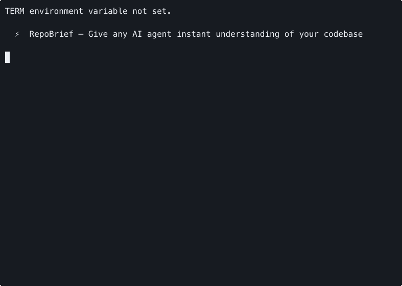

<p align="center">
  
</p>

<p align="center">
  <strong>Give any AI agent instant understanding of your codebase.</strong>
</p>

<p align="center">
  <a href="https://www.npmjs.com/package/repobrief"></a>
  <a href="https://github.com/joeynyc/repobrief/blob/master/LICENSE"></a>
  <a href="https://www.npmjs.com/package/repobrief"></a>
</p>

---

<p align="center">
  
</p>

## The Problem

Every time you start an AI coding session — Claude Code, Cursor, Codex, Cline — the agent **re-discovers your project from scratch**. It reads random files, guesses at your architecture, and burns tokens figuring out what you already know.

The result? Worse outputs. Wasted money. Slower development.

## The Fix

```bash
npx repobrief init
```

RepoBrief scans your repo and auto-generates a `.repobrief/` context directory:

| File | What it contains |
|------|-----------------|
| `architecture.md` | Project structure, entry points, build system |
| `patterns.md` | Coding conventions detected from your actual code |
| `dependencies.md` | Key deps categorized as runtime vs dev |
| `hotfiles.md` | Most-changed files from git history — where bugs live |
| `context.json` | Machine-readable version for tool integrations |

## Export to Your AI Tool

```bash
repobrief export --format claude    # → CLAUDE.md
repobrief export --format cursor    # → .cursorrules
repobrief export --format codex     # → AGENTS.md
repobrief export --format markdown  # → universal summary
```

One command. Your AI agent gets a complete briefing before writing a single line of code.

## Keep It Fresh

```bash
repobrief update
```

Re-scans your project and updates the context. Fast enough to run on every commit.

## Why RepoBrief?

| Without RepoBrief | With RepoBrief |
|---|---|
| AI re-reads your entire project every session | AI gets a structured briefing in seconds |
| Context files go stale immediately | `repobrief update` keeps them current |
| One format locked to one tool | Export to any AI tool's format |
| You write context docs by hand | Auto-generated from real code analysis |
| Doesn't scale past small projects | Built for monorepos and large codebases |

## Supported Projects

RepoBrief auto-detects your stack:

- **JavaScript / TypeScript** — package.json, tsconfig.json
- **Python** — requirements.txt, pyproject.toml, setup.py
- **Swift / Xcode** — Package.swift
- **Rust** — Cargo.toml
- **Go** — go.mod

## Install

```bash
# Run directly (no install needed)
npx repobrief init

# Or install globally
npm install -g repobrief
```

## How It Works

1. **Structure Analysis** — Detects project type, framework, build system, key directories, and entry points
2. **Dependency Analysis** — Parses manifest files, categorizes runtime vs dev dependencies
3. **Git History Analysis** — Identifies high-churn files, recent activity, and contributor patterns
4. **Pattern Detection** — Scans your code for naming conventions, import styles, and error handling patterns
5. **Context Assembly** — Combines all analysis into structured markdown + JSON
6. **Export** — Transforms context into the format your AI tool expects

## Contributing

RepoBrief is open source under the MIT License. Issues, PRs, and feedback welcome.

## License

MIT

---

<p align="center">
  Built by <a href="https://github.com/joeynyc">Joey Rodriguez</a> ⚡
</p>
